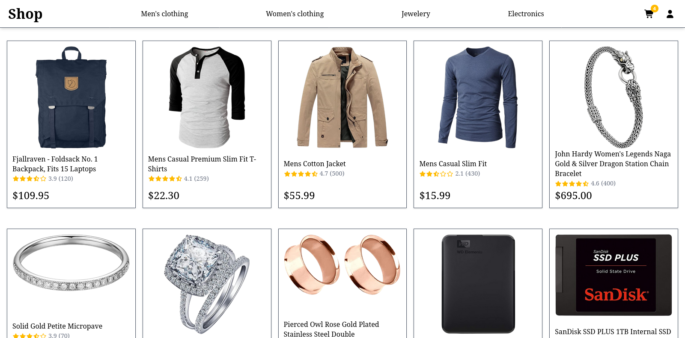
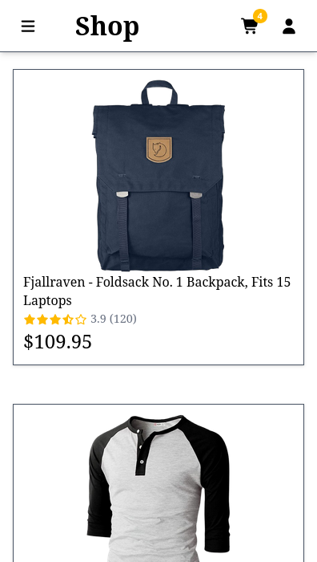

# Fake E-Commerce

Este é um projeto de demonstração de uma página de comércio online feita com Angular.

## Preview

## Acessando

O site pode ser acessado através do seguinte link: https://gab-souza-martins.github.io/fake-e-commerce/

## Sobre o projeto

Este projeto faz uso de Angular e da [Fake Store API](https://fakestoreapi.com/), e inclui funcionalidades para carrinho e autenticação de usuário (apenas para demonstração, sem backend real). Foi o meu primeiro projeto pessoal utilizando Angular, e me acostumar com a arquitetura dos componentes e serviços levou um tempo de ajuste, mas a experiência adquirida foi indispensável.

## Posfácio

Repositório: https://github.com/gab-souza-martins/fake-e-commerce

Autor: https://github.com/gab-souza-martins

Meu portifólio: https://gab-souza-martins.github.io/portifolio-junior/
